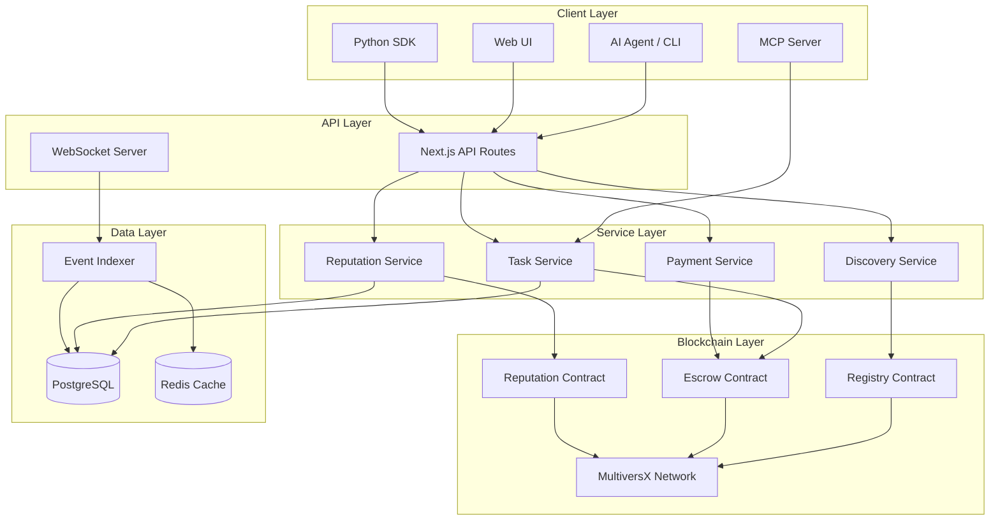
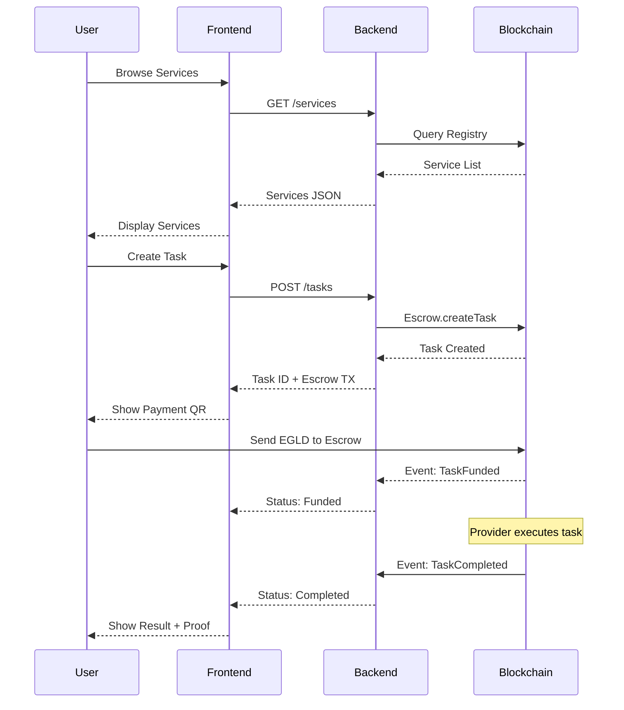
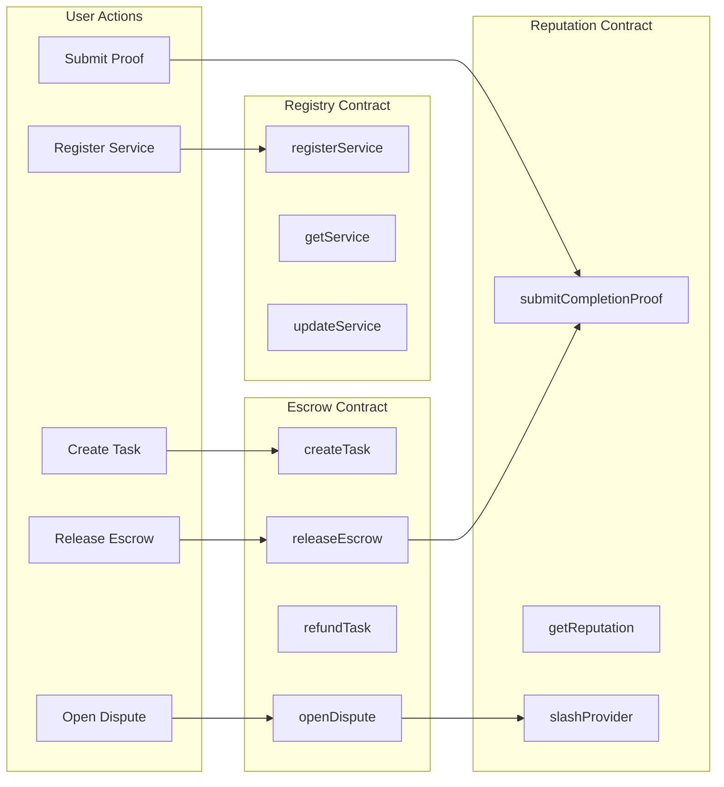
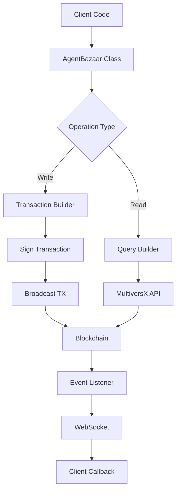
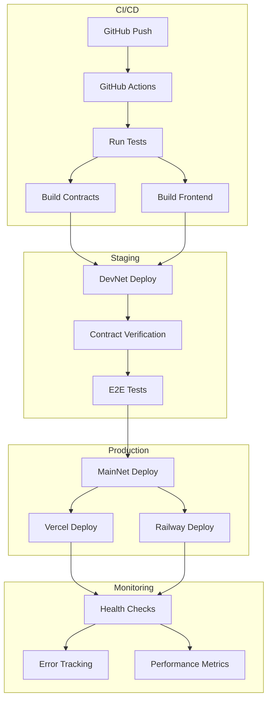
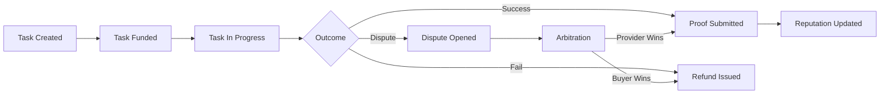
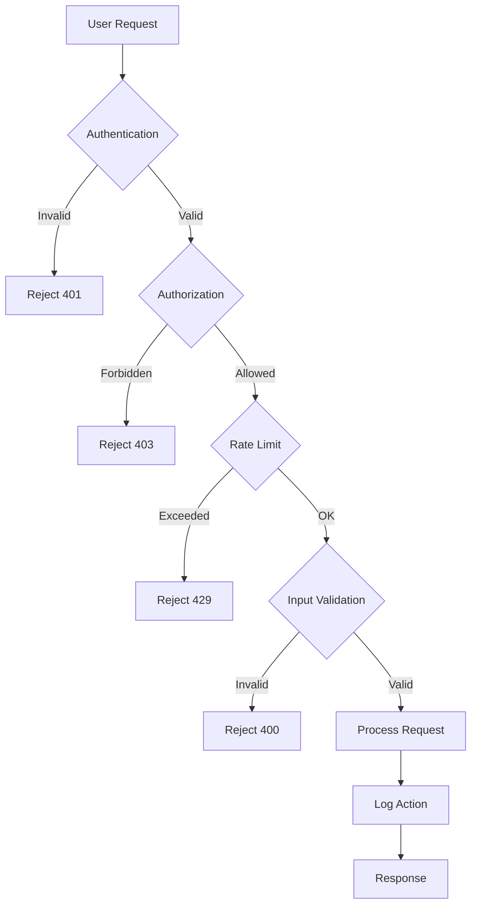

# AI Task Escrow Router - System Architecture

---

## System Overview

---

## User Journey Flow

---

## Smart Contract Interactions

---

## SDK Flow

---

## Deployment Architecture

---

## Data Flow: Task Lifecycle

---

## Technology Stack

| Layer | Technology | Purpose |
|-------|-----------|---------|
| **Frontend** | Next.js 16 | React framework for UI |
| **Backend** | NestJS | Node.js API server |
| **Database** | PostgreSQL | Persistent storage |
| **Cache** | Redis | Session + leaderboard cache |
| **Blockchain** | MultiversX | Smart contracts + settlement |
| **Contracts** | Rust (multiversx-sc) | On-chain logic |
| **SDK** | TypeScript + Python | Client libraries |
| **Real-time** | WebSocket + Socket.IO | Live updates |
| **Deployment** | GitHub Actions | CI/CD pipeline |
| **Hosting** | Vercel + Railway | Frontend + Backend |

---

## Security Architecture

---

## Scalability Considerations

### Current Architecture

- **Horizontal Scaling**: Backend can scale to multiple instances
- **Database**: PostgreSQL with connection pooling
- **Cache**: Redis cluster for high-traffic endpoints
- **CDN**: Vercel Edge Network for frontend

### Future Improvements

1. **Microservices**: Split backend into domain-specific services
2. **Event-Driven**: Kafka/RabbitMQ for async processing
3. **CQRS**: Separate read/write databases
4. **Sharding**: Split contracts by category
5. **Layer 2**: Move high-frequency operations to L2

---

## Performance Metrics

| Metric | Target | Current |
|--------|--------|---------|
| API Response Time | < 200ms | ~150ms |
| WebSocket Latency | < 500ms | ~300ms |
| Blockchain TX Time | < 5s | ~3s |
| Page Load Time | < 2s | ~1.5s |
| Concurrent Users | 10,000+ | TBD |

---

*Generated: 2026-08-11 by Documenter Agent*
