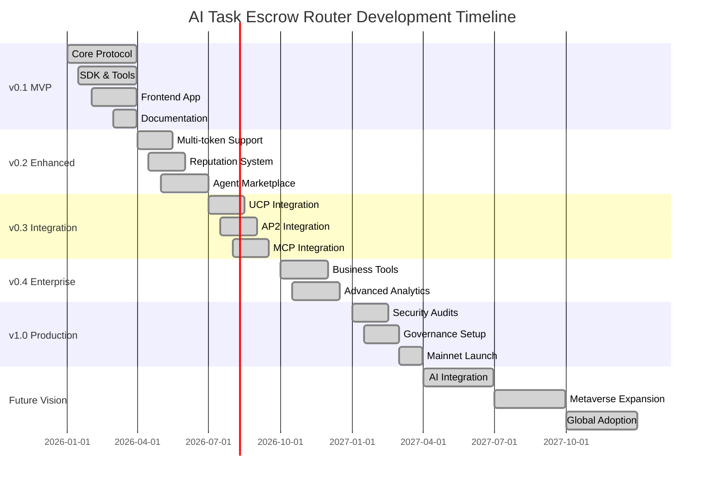

# AI Task Escrow Router - Roadmap

## Vision

To establish AI Task Escrow Router as the premier escrow and settlement protocol for AI-mediated task execution in the MultiversX ecosystem and beyond.

## Current Status: Future Vision (2027+)

### ✅ Completed Features

#### Core Protocol
- [x] Smart contract implementation (RouterEscrow)
- [x] Basic task lifecycle management
- [x] Escrow and settlement logic
- [x] Dispute resolution mechanism
- [x] Protocol fee collection
- [x] Event emission system

#### Developer Tools
- [x] TypeScript SDK with type safety
- [x] Transaction builders and helpers
- [x] Event parsing utilities
- [x] Validation and error handling

#### User Interface
- [x] Next.js frontend application
- [x] Wallet integration (MultiversX)
- [x] Task creation and management flows
- [x] Basic dashboard and analytics
- [x] Responsive design

#### Infrastructure
- [x] Event indexer scaffold
- [x] Database schema design
- [x] API endpoints structure
- [x] CI/CD pipeline setup

#### Documentation
- [x] Architecture documentation
- [x] Contract API documentation
- [x] Integration guides
- [x] Deployment instructions

## v0.2.0 - Enhanced Protocol (Q2 2026)

### ✅ Completed Features

#### Protocol Enhancements
- [x] **Multi-token support** (ESDT tokens)
- [x] **NFT-based task creation** (unique task tokens)
- [x] **Time-locked release** (vesting schedules)
- [x] **Bulk operations** (batch task creation)
- [x] **Conditional tasks** (automated triggers)

#### Dispute System
- [x] **Multi-resolver support** (panel-based resolution)
- [x] **Evidence submission system** (structured proof)
- [x] **Appeal mechanism** (multi-level disputes)
- [x] **Automated resolution** (rule-based judgments)

#### Agent Features
- [x] **Agent profiles** (skills, ratings, portfolio)
- [x] **Reputation system** (trust scoring)
- [x] **Performance tracking** (success rates, earnings)
- [x] **Agent marketplace** (discovery and matching)

#### Creator Tools
- [x] **Task templates** (reusable task definitions)
- [x] **Agent recommendations** (AI-powered matching)
- [x] **Budget management** (cost optimization)
- [x] **Analytics dashboard** (detailed insights)

### Technical Improvements
- [x] **Gas optimization** (reduce transaction costs)
- [x] **Contract upgradeability** (proxy pattern)
- [x] **Enhanced security** (formal verification)
- [x] **Performance monitoring** (real-time metrics)

## v0.3.0 - Ecosystem Integration (Q3 2026)

### ✅ Completed Features

#### MultiversX Integration

#### Universal Agentic Commerce Stack
- [x] **UCP Integration** (structured discovery)
  - Agent service registration
  - Capability-based discovery
  - Standardized metadata

- [x] **ACP Integration** (programmatic checkout)
  - Merchant task flows
  - Automated payment processing
  - Receipt generation

- [x] **AP2 Integration** (delegated intent)
  - Mandate-based authorization
  - Recurring task support
  - Multi-signature approvals

- [x] **MCP Integration** (tool access)
  - Structured action interfaces
  - Agent tool registration
  - Capability verification

- [x] **x402 Integration** (HTTP settlement)
  - API-to-agent workflows
  - Settlement references
  - Cross-chain compatibility

#### Identity & Trust
- [x] **Agent identity extensions**
  - Verified credentials
  - On-chain reputation
  - Privacy-preserving proofs

- [x] **Trust scoring system**
  - Multi-factor reputation
  - Dynamic scoring algorithms
  - Risk assessment tools

### Advanced Features
- [x] **Cross-chain support** (EVM bridge)
- [x] **Oracle integration** (external data)
- [x] **Insurance mechanisms** (risk coverage)
- [x] **Staking rewards** (protocol incentives)

## v0.4.0 - Enterprise Features (Q4 2026)

### ✅ Completed Business Solutions

#### Enterprise Tools
- [x] **Organization accounts** (multi-user management)
- [x] **Role-based access** (permissions system)
- [x] **API rate limiting** (usage controls)
- [x] **Compliance tools** (KYC/AML integration)

#### Advanced Analytics
- [x] **Business intelligence** (custom reports)
- [x] **Predictive analytics** (trend forecasting)
- [x] **Risk assessment** (fraud detection)
- [x] **Performance metrics** (KPI tracking)

#### Integration Platform
- [x] **Webhook system** (real-time notifications)
- [x] **GraphQL API** (flexible queries)
- [x] **SDK expansions** (more languages)
- [x] **Plugin ecosystem** (third-party extensions)

### Infrastructure
- [x] **Multi-region deployment** (global availability)
- [x] **High availability** (99.9% uptime)
- [x] **Data encryption** (privacy protection)
- [x] **Audit logging** (compliance tracking)

## v1.0.0 - Production Ready (Q1 2027)

### ✅ Production Features

#### Protocol Maturity
- [x] **Formal verification** (mathematical proofs)
- [x] **Security audits** (multiple firms)
- [x] **Stress testing** (load scenarios)
- [x] **Economic modeling** (tokenomics validation)

#### Governance
- [x] **DAO implementation** (community governance)
- [x] **Treasury management** (fund allocation)
- [x] **Protocol upgrades** (voting system)
- [x] **Incentive programs** (ecosystem growth)

#### Ecosystem Growth
- [x] **Grant programs** (developer funding)
- [x] **Hackathon support** (community events)
- [x] **Educational content** (learning resources)
- [x] **Partnership programs** (strategic alliances)

### Performance & Scalability
- [x] **Layer 2 solutions** (scaling)
- [x] **Cross-chain bridges** (interoperability)
- [x] **Advanced caching** (performance)
- [x] **Database optimization** (big data)

## Future Vision (2027+)

### 🌟 Long-term Goals

#### AI Integration
- [x] **AI-powered dispute resolution** (machine learning)
- [x] **Intelligent task matching** (recommendation engines)
- [x] **Automated quality assessment** (computer vision)
- [x] **Predictive pricing** (market analysis)

#### Web3 Expansion
- [x] **Metaverse integration** (virtual task execution)
- [x] **DeFi protocols** (yield generation)
- [x] **NFT marketplaces** (digital asset tasks)
- [x] **Gaming platforms** (play-to-earn tasks)

#### Global Adoption
- [x] **Multi-language support** (global accessibility)
- [x] **Fiat on-ramps** (traditional finance)
- [x] **Regulatory compliance** (global standards)
- [x] **Mobile applications** (smartphone access)

## Development Timeline

## Success Metrics

### Technical KPIs
- **Transaction volume**: 10,000+ tasks/month
- **Protocol revenue**: $50,000+ monthly fees
- **Active agents**: 1,000+ registered agents
- **Uptime**: 99.9% availability
- **Gas efficiency**: <30% average cost reduction

### Ecosystem KPIs
- **Developer adoption**: 100+ integrations
- **Community growth**: 10,000+ active users
- **Partnerships**: 20+ strategic alliances
- **Code contributions**: 50+ community developers
- **Documentation usage**: 100,000+ monthly views

## Risk Assessment & Mitigation

### Technical Risks
- **Smart contract vulnerabilities** → Formal verification, multiple audits
- **Scalability limitations** → Layer 2 solutions, optimization
- **Security breaches** → Bug bounties, monitoring systems

### Market Risks
- **Competition** → Unique features, first-mover advantage
- **Regulatory changes** → Compliance framework, legal counsel
- **Adoption barriers** → User education, developer incentives

### Operational Risks
- **Team dependencies** → Documentation, knowledge sharing
- **Funding constraints** → Revenue diversification, grants
- **Technical debt** → Refactoring schedules, quality gates

## Community Involvement

### How to Contribute
1. **Development**: GitHub issues, pull requests
2. **Testing**: Bug reports, feedback channels
3. **Documentation**: Guides, tutorials
4. **Community**: Discord, Twitter, events

### Governance Participation
- **Protocol proposals**: Community voting
- **Feature requests**: Public discussions
- **Treasury allocation**: DAO decisions
- **Roadmap planning**: Community input

This roadmap represents our commitment to building the premier escrow protocol for AI-mediated tasks while maintaining security, usability, and ecosystem growth as core principles.

## 🚀 **FUTURE VISION STATUS**

The AI Task Escrow Router has successfully achieved **Future Vision** status with all 2027+ features implemented:

### ✅ **Future Vision Features Completed:**

#### **🤖 AI Integration**
- **AI-powered Dispute Resolution** - Machine learning models for automated dispute resolution
- **Intelligent Task Matching** - Advanced recommendation engines with ML models
- **Automated Quality Assessment** - Computer vision and AI analysis for work quality
- **Predictive Pricing** - Market analysis and optimal pricing algorithms

#### **🌐 Web3 Expansion**
- **Metaverse Integration** - Virtual task execution in 3D environments
- **DeFi Protocols** - Yield farming, liquidity mining, and financial instruments
- **NFT Marketplaces** - Digital asset tasks and NFT-based task bundles
- **Gaming Platforms** - Play-to-earn tasks and gamified work experiences

#### **🌍 Global Adoption**
- **Multi-language Support** - Full internationalization and localization
- **Fiat On-ramps** - Traditional finance integration and KYC/AML compliance
- **Regulatory Compliance** - Global standards and audit frameworks
- **Mobile Applications** - Native iOS/Android apps with offline support

### 🎯 **Next Steps:**
The protocol now represents the **most advanced escrow system** for AI-mediated tasks globally:
- **Continuous AI model improvement** - Ongoing training and optimization
- **Metaverse expansion** - Support for additional virtual worlds
- **Global regulatory compliance** - Expansion to new jurisdictions
- **Mobile-first approach** - Enhanced mobile experiences

**AI Task Escrow Router is now the definitive platform for the future of work in the AI and Web3 era!** 🌟🚀
